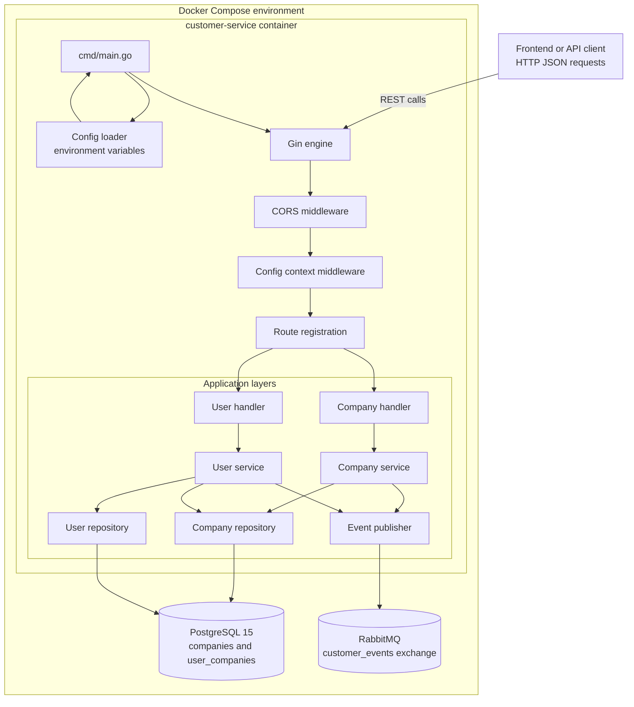

# Architecture Diagram

This diagram shows the main runtime components of the service, from incoming HTTP traffic to persistence and event publishing.

```mermaid
flowchart TB
    client[Frontend or API client\nHTTP JSON requests]

    subgraph compose[Docker Compose environment]
        db[(PostgreSQL 15\ncompanies and user_companies)]
        rabbit[(RabbitMQ\ncustomer_events exchange)]

        subgraph app_container[customer-service container]
            main[cmd/main.go]
            cfg[Config loader\nenvironment variables]
            gin[Gin engine]
            cors[CORS middleware]
            ctxcfg[Config context middleware]
            routes[Route registration]

            subgraph app_layers[Application layers]
                companyHandler[Company handler]
                userHandler[User handler]
                companyService[Company service]
                userService[User service]
                companyRepo[Company repository]
                userRepo[User repository]
                publisher[Event publisher]
            end
        end
    end

    client -->|REST calls| gin
    main --> cfg
    cfg --> main
    main --> gin
    gin --> cors --> ctxcfg --> routes
    routes --> companyHandler
    routes --> userHandler
    companyHandler --> companyService --> companyRepo --> db
    userHandler --> userService --> userRepo --> db
    userService --> companyRepo
    companyService --> publisher --> rabbit
    userService --> publisher
```
