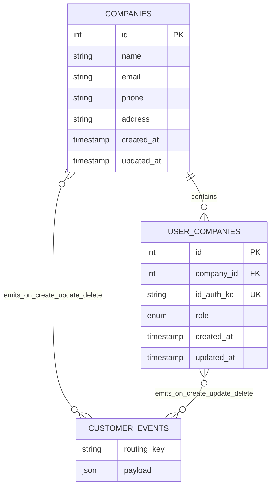

# Domain Data Model Diagram

This extra diagram is especially useful here because the project revolves around a small domain model: companies, company-linked users, and emitted domain events.

```mermaid
erDiagram
    COMPANIES ||--o{ USER_COMPANIES : contains

    COMPANIES {
        int id PK
        string name
        string email
        string phone
        string address
        timestamp created_at
        timestamp updated_at
    }

    USER_COMPANIES {
        int id PK
        int company_id FK
        string id_auth_kc UK
        enum role
        timestamp created_at
        timestamp updated_at
    }

    CUSTOMER_EVENTS {
        string routing_key
        json payload
    }

    COMPANIES }o--o{ CUSTOMER_EVENTS : emits_on_create_update_delete
    USER_COMPANIES }o--o{ CUSTOMER_EVENTS : emits_on_create_update_delete
```
