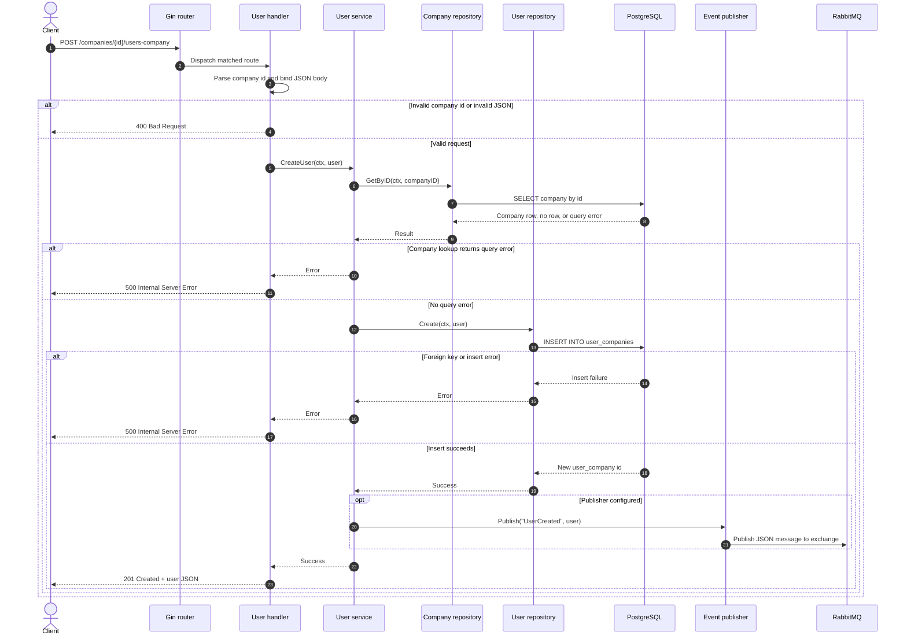

# Request Sequence Diagram

This sequence shows the most representative workflow in the service: creating a user membership for a company.

```mermaid
sequenceDiagram
    autonumber
    actor Client
    participant Gin as Gin router
    participant UserHandler as User handler
    participant UserService as User service
    participant CompanyRepo as Company repository
    participant UserRepo as User repository
    participant Postgres as PostgreSQL
    participant Publisher as Event publisher
    participant RabbitMQ as RabbitMQ

    Client->>Gin: POST /companies/{id}/users-company
    Gin->>UserHandler: Dispatch matched route
    UserHandler->>UserHandler: Parse company id and bind JSON body

    alt Invalid company id or invalid JSON
        UserHandler-->>Client: 400 Bad Request
    else Valid request
        UserHandler->>UserService: CreateUser(ctx, user)
        UserService->>CompanyRepo: GetByID(ctx, companyID)
        CompanyRepo->>Postgres: SELECT company by id
        Postgres-->>CompanyRepo: Company row, no row, or query error
        CompanyRepo-->>UserService: Result

        alt Company lookup returns query error
            UserService-->>UserHandler: Error
            UserHandler-->>Client: 500 Internal Server Error
        else No query error
            UserService->>UserRepo: Create(ctx, user)
            UserRepo->>Postgres: INSERT INTO user_companies
            alt Foreign key or insert error
                Postgres-->>UserRepo: Insert failure
                UserRepo-->>UserService: Error
                UserService-->>UserHandler: Error
                UserHandler-->>Client: 500 Internal Server Error
            else Insert succeeds
                Postgres-->>UserRepo: New user_company id
                UserRepo-->>UserService: Success

                opt Publisher configured
                    UserService->>Publisher: Publish("UserCreated", user)
                    Publisher->>RabbitMQ: Publish JSON message to exchange
                end

                UserService-->>UserHandler: Success
                UserHandler-->>Client: 201 Created + user JSON
            end
        end
    end
```
